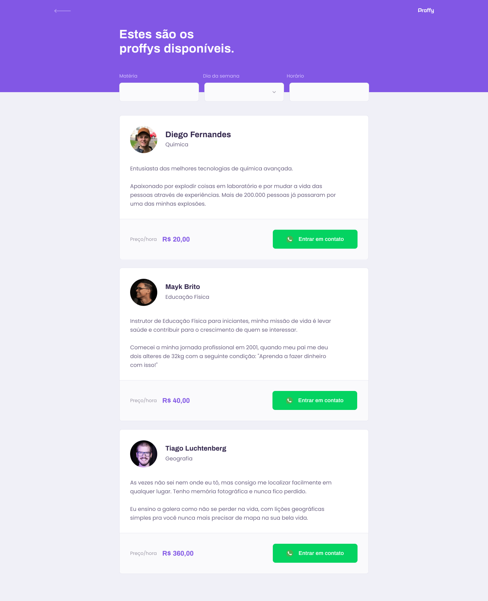

  <h1 align="center">
    Next Level Week 2.0 by  
    
  </h1>
  
  

  

_________

### 🤔 Sobre o que se trata ? 
A NLW é uma experiência online criada pela Rocketseat de uma semana com muito conteúdo prático, desafios, hacks e um projeto que nos ajudam a avançar para o próximo nível e impulsionar a nossa carreira. 🤩🤩
  
### ✨ Sobre o projeto:

 é um projeto criado para gerenciar uma plataforma de estudos online. Com ele, é possível encontrar professores para aulas particulares e professores também podem se cadastrar para encontrar alunos online.
  
### 👀 Meu aprendizado até aqui:
(Dia 01!!) - Primeiro dia finalizado da NLW-2.0, onde desenvolvemos uma aplicação do zero até (Front-End com ReactJs), hoje, eu conseguir colocar em práticas vários conceitos de programação com js usando Reactjs, também conseguir aprimorar minhas habilidades com JSX e CSS, onde pude revisar conceitos básicos à avançados e colocá-los em prática novamente. Tive oportunidade de tirar dúvidas com outros devs que participaram do evento, compartilhar conhecimentos, ideias, etc..

<h2 align="center"> 📷 Screenshot da home page do projeto: </h2>

<h3 align="center"> 📷 Screenshot da Listagem de professores page do projeto: </h3>

# [Uso]()

## Desenvolvimento

Para corrigir um bug ou melhorar um módulo existente, siga estas etapas:

- Garfo o repo
- Criar um novo ramo (`git checkout -b improve-feature`)
- Faça as alterações apropriadas nos arquivos
- Adicione alterações para refletir as alterações feitas
- Comprometa suas alterações (`git commit -am 'Improve feature'`)
- Empurre para o ramo (`git push origin improve-feature`)
- Crie uma solicitação de atração

# Construído com:
- [JSX](#) - HTML é uma linguagem de marcação utilizada na construção de páginas na Web.

- [CSS](#) - Cascading Style Sheets é um mecanismo para adicionar estilo a um documento web.

- [REACTJS](#) - JavaScript é uma linguagem de programação interpretada estruturada, de script em alto nível com tipagem dinâmica fraca e multiparadigma. 

_________

  | 
  ---|---
[Perfil Github ](https://github.com/iharsh234) |[Perfil Linkedin](https://www.quandl.com)

_________
<h4 align="center">❤❤❤ O evento está sendo de grande aprendizagem, onde poderei aplicar os conhecimentos adquidos em outros projetos ❤❤❤ </h4>